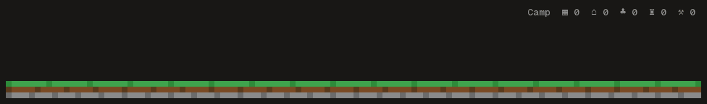
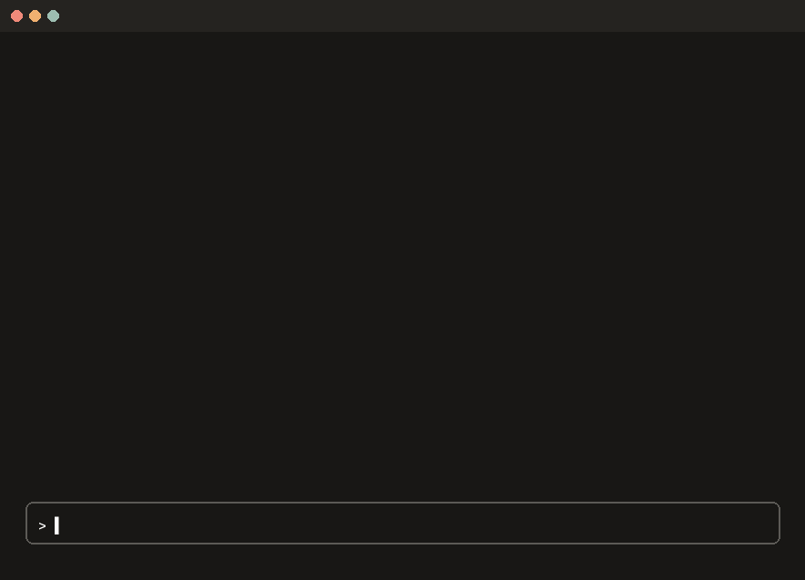
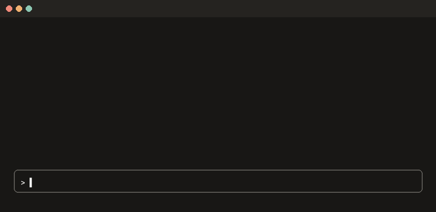
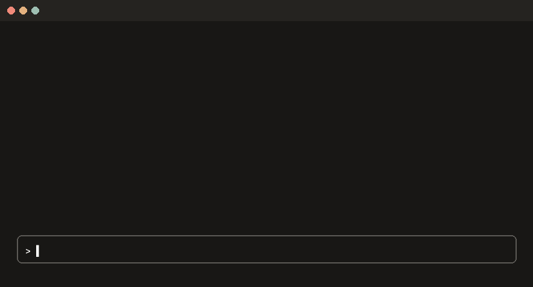
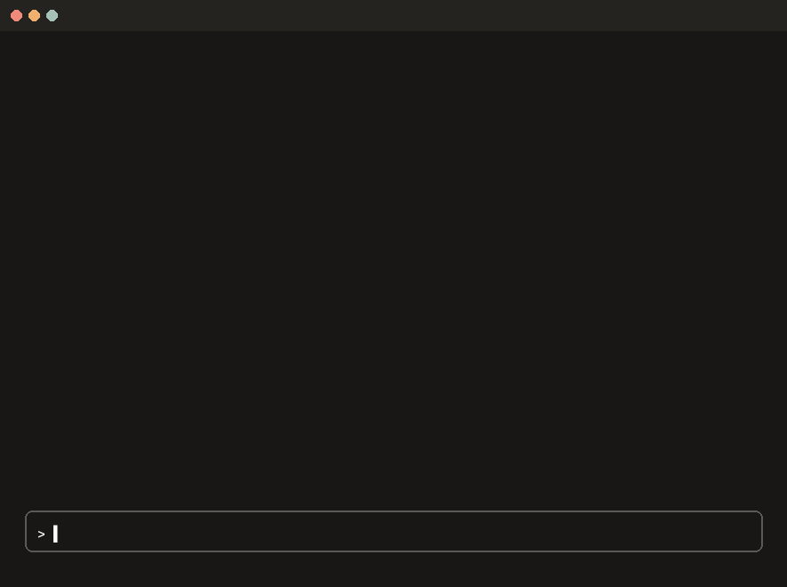
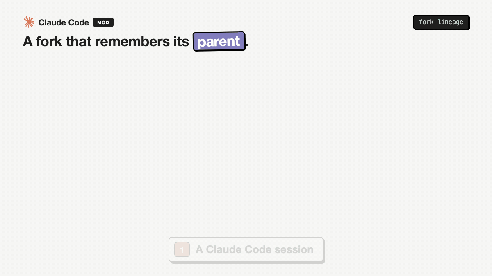

# claude-plugins


[](https://github.com/sponsors/mutlumehmet)
[](https://buymeacoffee.com/mutlumehmet)
[](LICENSE)

Claude Code plugins I use every day, cleaned up so they work on anyone's machine. Formerly
`agent-skills`; old links redirect here.

**Contents:** [Claude Code Arcade](#claude-code-arcade) · [Claude Code Toolkit](#claude-code-toolkit) ·
[Skills](#skills) · [Install](#install) · [Contributing](#contributing) · [About](#about)

## Claude Code Arcade

Pixel games that live above your prompt and are played by your work: every tool call, commit,
merge and failed test moves the game on. Ten games in one plugin, [`arcade`](plugins/arcade).


**Install it** (type these at the Claude Code prompt, then pick a scope; there is nothing to set up):

```
/plugin marketplace add mutlumehmet/claude-plugins
/plugin install arcade@mehmetmutlu
```

**Play:** Octo Invader starts by itself. Above the game sit small buttons: **◀ ▶** switch
to the previous or next game, **☰** opens the game menu, and **☆ make default** (it shows once you
switch) makes that game the one every new terminal starts with; **⟳** checks for a new Arcade version and
installs it. Prefer typing? `/arcade` opens
the menu, `/arcade duck` plays Duck Hunt here, `/arcade default duck` makes it your default.

<table>
<tr><td>
<b>Octo Invader</b> <code>/arcade octopus</code>: a pixel octopus smashes a city the full width of the line while Claude edits<br>

</td></tr>
<tr><td>
<b>Duck Hunt</b> <code>/arcade duck</code>: your moments shoot the ducks down, failed tools let them fly away<br>

</td></tr>
<tr><td>
<b>Bug Command</b> <code>/arcade bugs</code>: bugs fall on six cities; Claude's tools shoot them down, and you can click the sky to fire too<br>

</td></tr>
<tr><td>
<b>Dario</b> <code>/arcade dario</code>: a side scroller; tool calls bring ? blocks and coins, a failed tool sends a bug<br>

</td></tr>
<tr><td>
<b>Block Town</b> <code>/arcade town</code>: your agents build a medieval town in blocks; big moments raise a castle<br>

</td></tr>
<tr><td>

Five small games at the right of the line:<br>
<b>Dragon Lair</b> <code>/arcade dragon</code>: a pixel dragon that breathes fire when you ship<br>
<b>Jackpot</b> <code>/arcade jackpot</code>: a slot machine; every finished turn pulls the lever<br>
<b>Outlaw</b> <code>/arcade outlaw</code>: an Atari duel; you fire at the good moments, the bug when a tool fails<br>
<b>Tama</b> <code>/arcade tama</code>: a Tamagotchi your work feeds, or it packs its bags<br>
<b>Tetris</b> <code>/arcade tetris</code>: Claude's tools drop the pieces
</td></tr>
</table>

Every game, what counts as a moment, and every command: [the Arcade's own page](plugins/arcade).

## Claude Code Toolkit

Small mods for long sessions. Install them all with `/plugin install toolkit@mehmetmutlu`
([`toolkit`](plugins/toolkit)), or any one by name.

<table>
<tr>
<td valign="top" width="50%">
<a href="plugins/subtask-icons"></a><br>
<b><a href="plugins/subtask-icons"><code>subtask-icons</code></a></b>: A <code>⑂ Subtask</code> button under the last answer that puts <code>/subtask &lt;item&gt;</code> in the prompt box, and a <code>Pin list</code> button that keeps that list above the prompt while you work through it
</td>
<td valign="top" width="50%">
<a href="plugins/context-alarm"></a><br>
<b><a href="plugins/context-alarm"><code>context-alarm</code></a></b>: Warns as the context fills up and suggests <code>/save-context</code> before compaction
</td>
</tr>
<tr>
<td valign="top" width="50%">
<a href="plugins/answer-buttons"></a><br>
<b><a href="plugins/answer-buttons"><code>answer-buttons</code></a></b>: Plain English, Shorter and Plain & short buttons under the last answer
</td>
<td valign="top" width="50%">
<a href="plugins/skill-stats"></a><br>
<b><a href="plugins/skill-stats"><code>skill-stats</code></a></b>: Which skills run, which never trigger, and a hand off to skill-creator
</td>
</tr>
<tr>
<td valign="top" width="50%">
<a href="plugins/dash-guard"></a><br>
<b><a href="plugins/dash-guard"><code>dash-guard</code></a></b>: Refuses prose with em dashes, en dashes or double hyphens
</td>
<td valign="top" width="50%">
<a href="plugins/shared-file-guard"></a><br>
<b><a href="plugins/shared-file-guard"><code>shared-file-guard</code></a></b>: Refuses shell writes to shared files another session changed
</td>
</tr>
<tr>
<td valign="top" width="50%">
<a href="plugins/fork-lineage"></a><br>
<b><a href="plugins/fork-lineage"><code>fork-lineage</code></a></b>: Shows which session a fork came from, and sends the fork's report to its parent when you approve
</td>
</tr>
</table>

## Skills

Both come in one plugin, [`project-workflow`](plugins/project-workflow): `/plugin install project-workflow@mehmetmutlu`.

<table>
<tr>
<td valign="top" width="50%">
<a href="plugins/project-workflow/skills/create-project"></a><br>
<b><a href="plugins/project-workflow/skills/create-project"><code>create-project</code></a></b>: Sets up a new project folder the same way every time
</td>
<td valign="top" width="50%">
<a href="plugins/project-workflow/skills/save-context"></a><br>
<b><a href="plugins/project-workflow/skills/save-context"><code>save-context</code></a></b>: Saves what a session decided, changed and left open before you close it
</td>
</tr>
</table>

## Install

A plugin is a package Claude Code installs as one unit. Here a plugin holds either **skills**
(folders of instructions Claude loads when a task calls for them) or a **mod** (a small piece of
code that runs inside Claude Code and can hold, change or add to what it does). Anything that
differs between people lives in a config file or a plugin setting, and every integration beyond the
basics is optional.

Add this repo as a marketplace once, then install the plugins you want:

```
/plugin marketplace add mutlumehmet/claude-plugins
/plugin install <plugin>@mehmetmutlu
```

Skills run as `/<plugin>:<skill>`, or by their short name when nothing else uses it, or just
describe the task and Claude picks them up. Mods need Claude Code 2.1.287 or later and run with your
permissions, so read a mod's code before you install it.

If you installed `create-project` or `save-context` from the old `mutlumehmet-agent-skills`
marketplace, remove it and install `project-workflow@mehmetmutlu` instead.

**Skills without the plugin system** (anywhere that reads a skills folder): copy or symlink a skill
folder into your skills directory.

```bash
git clone https://github.com/mutlumehmet/claude-plugins.git
ln -s "$PWD/claude-plugins/plugins/project-workflow/skills/<skill>" ~/.claude/skills/<skill>
```

## Contributing

Issues and pull requests are welcome. The rules every plugin follows are in [`CLAUDE.md`](CLAUDE.md):
nothing personal in the repo, everything configurable has a default, English only.

`scripts/check-personal.sh` is a pre-commit hook that refuses commits containing anything from your
own list of personal terms (kept outside the repo). Install it with:

```bash
ln -sf ../../scripts/check-personal.sh .git/hooks/pre-commit
```

## About

[](https://www.mehmetmutlu.dev)

I'm Mehmet Mutlu, a London-based software engineer with 10+ years of building for the web, now
focused on AI. I was an early adopter of AI in day-to-day engineering and became my team's AI
advocate, building agentic workflows that were adopted by teams and professionals. Today I build
AI-native solutions for businesses with complex workflows, and AI tools for teams, engineers,
designers and professionals. This repo is where I share the pieces that proved useful day to day.

- Portfolio: [mehmetmutlu.dev](https://www.mehmetmutlu.dev)
- LinkedIn: [Mehmet Mutlu](https://www.linkedin.com/in/mehmet-mutlu-03aa7319a/)
- X: [@findmutlu](https://x.com/findmutlu)
- GitHub: [@mutlumehmet](https://github.com/mutlumehmet)

If a plugin here saves you some time, you can [sponsor me on GitHub](https://github.com/sponsors/mutlumehmet) or [buy me a coffee](https://buymeacoffee.com/mutlumehmet).

## License

[MIT](LICENSE)
