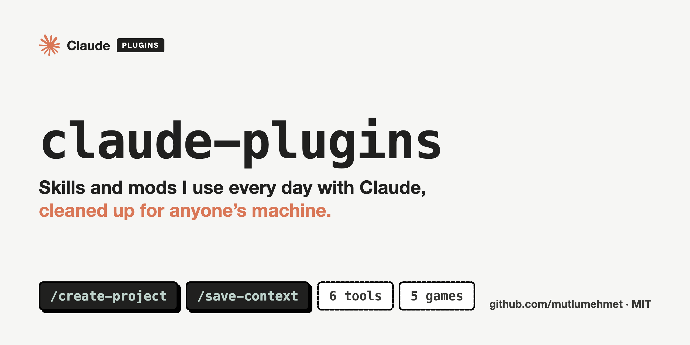

# claude-plugins



[](https://github.com/sponsors/mutlumehmet)
[](https://buymeacoffee.com/mutlumehmet)
[](LICENSE)

Claude Code plugins I use every day, cleaned up so they work on anyone's machine. Formerly
`agent-skills`; old links redirect here.

A plugin is a package Claude Code installs as one unit. Here a plugin holds either **skills**
(folders of instructions Claude loads when a task calls for them) or a **mod** (a small piece of
code that runs inside Claude Code and can hold, change or add to what it does). Nothing here is tied
to my setup: anything that differs between people lives in a config file or a plugin setting, and
every integration beyond the basics is optional.

## Plugins

Each plugin has its own page with what it does, its settings and its known gaps.

| Plugin | Kind | What it does |
|---|---|---|
| [`project-workflow`](plugins/project-workflow) | skills | [`create-project`](plugins/project-workflow/skills/create-project) sets up a new project folder the same way every time; [`save-context`](plugins/project-workflow/skills/save-context) saves what a session decided, changed and left open before you close it |

### Claude Code Toolkit

Six small mods for long sessions. Install all six with `/plugin install toolkit@mehmetmutlu`
([`toolkit`](plugins/toolkit)), or any one by name.

| Plugin | Kind | What it does |
|---|---|---|
| [`subtask-icons`](plugins/subtask-icons) | mod | A `⑂ Subtask` button under the last answer that puts `/subtask <item>` in the prompt box |
| [`context-alarm`](plugins/context-alarm) | mod | Warns as the context fills up and suggests `/save-context` before compaction |
| [`answer-buttons`](plugins/answer-buttons) | mod | Plain English, Shorter and Plain & short buttons under the last answer |
| [`skill-stats`](plugins/skill-stats) | mod | Which skills run, which never trigger, and a hand off to skill-creator |
| [`dash-guard`](plugins/dash-guard) | mod | Refuses prose with em dashes, en dashes or double hyphens |
| [`shared-file-guard`](plugins/shared-file-guard) | mod | Refuses shell writes to shared files another session changed |

### Claude Code Arcade

Five games that live above your prompt and are played by your work. Each one spots the moments
worth celebrating on its own, coding or not: small (a turn done, a file saved), medium (a commit, a
skill run, a message sent) and big (a merge, a deploy, a finished task list, a PDF made). Install one
or all; each works alone. Install all five with `/plugin install arcade@mehmetmutlu`
([`arcade`](plugins/arcade)); with several showing, hide some with `/<game> hide`.

| Plugin | Kind | What it does |
|---|---|---|
| [`dragon-lair`](plugins/dragon-lair) | mod | A pixel dragon that acts out what Claude does and breathes fire when you ship |
| [`jackpot`](plugins/jackpot) | mod | A slot machine: every finished turn pulls the lever |
| [`outlaw`](plugins/outlaw) | mod | An Atari duel: your bugs shoot back |
| [`tama`](plugins/tama) | mod | A Tamagotchi your work feeds, or it packs its bags |
| [`tetris`](plugins/tetris) | mod | Tetris where Claude's tools drop the pieces |

## Install

Add this repo as a marketplace once, then install the plugins you want:

```
/plugin marketplace add mutlumehmet/claude-plugins
/plugin install <plugin>@mehmetmutlu
```

Skills run as `/<plugin>:<skill>`, or by their short name when nothing else uses it, or just
describe the task and Claude picks them up. Mods need Claude Code 2.1.287 or later and run with your
permissions, so read a mod's code before you install it.

If you installed `create-project` or `save-context` from the old `mutlumehmet-agent-skills`
marketplace, remove it and install `project-workflow@mehmetmutlu` instead.

**Skills without the plugin system** (anywhere that reads a skills folder): copy or symlink a skill
folder into your skills directory.

```bash
git clone https://github.com/mutlumehmet/claude-plugins.git
ln -s "$PWD/claude-plugins/plugins/project-workflow/skills/<skill>" ~/.claude/skills/<skill>
```

## Contributing

Issues and pull requests are welcome. The rules every plugin follows are in [`CLAUDE.md`](CLAUDE.md):
nothing personal in the repo, everything configurable has a default, English only.

`scripts/check-personal.sh` is a pre-commit hook that refuses commits containing anything from your
own list of personal terms (kept outside the repo). Install it with:

```bash
ln -sf ../../scripts/check-personal.sh .git/hooks/pre-commit
```

## About

[](https://www.mehmetmutlu.dev)

I'm Mehmet Mutlu, a London-based software engineer with 10+ years of building for the web, now
focused on AI. I was an early adopter of AI in day-to-day engineering and became my team's AI
advocate, building agentic workflows that were adopted by teams and professionals. Today I build
AI-native solutions for businesses with complex workflows, and AI tools for teams, engineers,
designers and professionals. This repo is where I share the pieces that proved useful day to day.

- Portfolio: [mehmetmutlu.dev](https://www.mehmetmutlu.dev)
- LinkedIn: [Mehmet Mutlu](https://www.linkedin.com/in/mehmet-mutlu-03aa7319a/)
- X: [@findmutlu](https://x.com/findmutlu)
- GitHub: [@mutlumehmet](https://github.com/mutlumehmet)

If a plugin here saves you some time, you can [sponsor me on GitHub](https://github.com/sponsors/mutlumehmet) or [buy me a coffee](https://buymeacoffee.com/mutlumehmet).

## License

[MIT](LICENSE)
