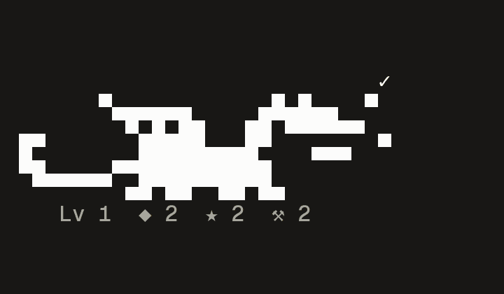
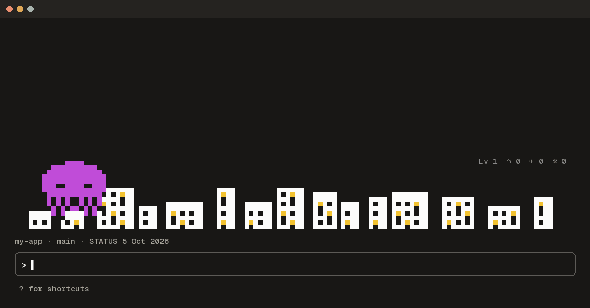
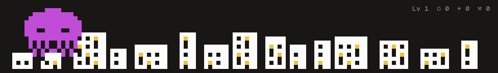
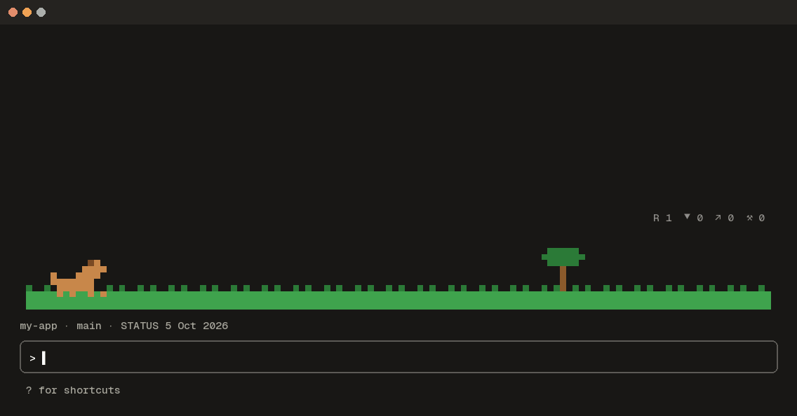
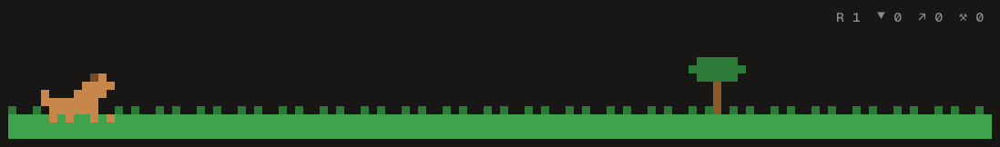
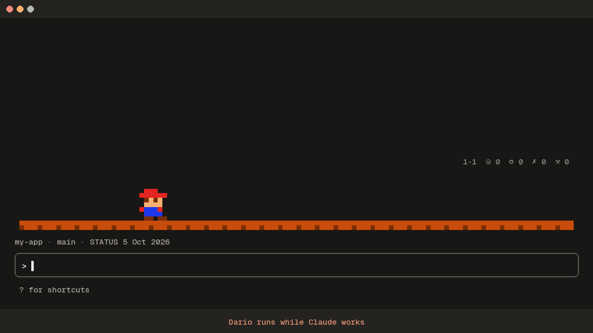
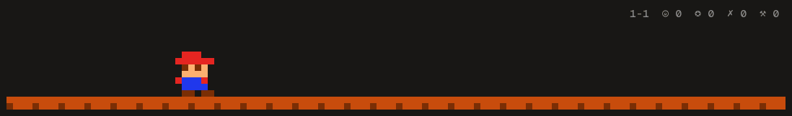
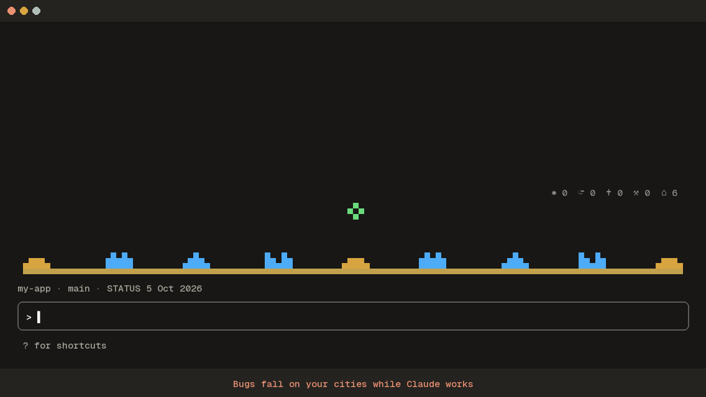
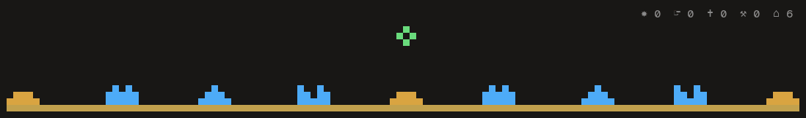

# arcade

The Claude Code Arcade: pixel games in the line above the prompt, played by your work. Pin the
one you like, rotate through them, or get a random one in every new terminal. Part of
[claude-plugins](../../README.md).



| Game | Command | What it is |
|---|---|---|
| Dragon Lair | `/dragon` | A pixel dragon that acts out what Claude does and breathes fire when you ship |
| Jackpot | `/jackpot` | A slot machine: every finished turn pulls the lever |
| Outlaw | `/outlaw` | An Atari duel: your gunslinger fires at the good moments, the bug fires when a tool fails |
| Tama | `/tama` | A Tamagotchi your work feeds, or it packs its bags |
| Tetris | `/tetris` | Tetris where Claude's tools drop the pieces |
| Octo Invader | `/octopus` | A pixel octopus that smashes a city the full width of the line while Claude edits |
| Duck Hunt | `/duck` | A dog and a marsh the full width of the line: your moments shoot the ducks down, failed tools let them fly away |
| Dario | `/dario` | A side scroller the full width of the line: tool calls bring ? blocks and coins, a failed tool sends a bug, moments stomp bugs and clear the course at the flag pole |
| Block Town | `/town` | A side view medieval town in blocks that your agents build: every tool call lays blocks, subagents send helpers, creepers blow holes, big moments raise a castle |
| Bug Command | `/bugs` | Bugs fall on six cities the full width of the line; Claude's tools shoot them down, and you can click the sky to fire too |

## Choosing the games

Each new terminal shows the games the `mode` and `pool` settings pick. By default it is one game at
random from all of them.

| Command | What it does |
|---|---|
| `/arcade` | Shows the setting and which games this terminal shows |
| `/arcade tetris` | Swaps this terminal to Tetris; other terminals and the setting stay as they are |
| `/arcade tetris all` | Pins Tetris: every terminal shows it, new ones too (`mode` fixed, Tetris first in the pool) |
| `/arcade random`, `rotate`, `all`, `off` | Sets how new terminals pick |
| `/arcade pool dragon tetris` | Picks only from these games |
| `/arcade next` | Swaps this terminal to the next game in the pool; new terminals still follow the setting |
| `/arcade hide` | Clears this terminal; `/arcade next` brings a game back |

The setting lives in Claude Code's settings (`pluginConfigs`), so the `/config` menu shows it too, and
each Claude Code config directory keeps its own: a work and a personal account can show different
games. Where there is no settings menu (`claude -p`), `/arcade` keeps the choice in the plugin's own
store, still per config directory, until the settings change. A game that is not shown keeps playing and keeps its score; it only stops drawing and stays quiet. A game's own command (`/dragon`, `/duck` and the rest) shows its score and plays its practice moves; which games show is only ever `/arcade`.

## The games

### Dragon Lair (`dragon`)

A small one colour pixel dragon that lives at the right end of the line above the prompt. It acts out what Claude is doing and breathes fire when something worth celebrating happens.

- **While Claude works** the dragon shows it: it hops when you send a message, raises its head while Claude thinks, bends over the page while a file is read, paces while a file is edited, beats its wings for shell commands and takes off for web and MCP tools.
- **Each subagent** hatches from an egg as a small dragon that flies beside it, flaps faster as the subagent works, and flies home when it finishes (or falls when it fails).
- **A failed tool** drops its head; **two minutes of quiet** and it falls asleep.
- **Moments**: a small one is a puff of smoke, a medium one a breath of fire, a big one a blaze, and a merge, release, deploy, streak or record a roar.
- **Gold** builds up with every moment and is kept between sessions. Under the dragon: `Lv 3  ◆ 55  ★ 9  ⚒ 58` (level, gold, wins, tool calls).
- **`/dragon`** shows the hoard; `/dragon puff`, `fire`, `blaze` and `roar` show off each size.

### Jackpot (`jackpot`)

A pixel slot machine at the right end of the line above the prompt. Every finished turn pulls the lever; the moments worth celebrating earn golden spins with better odds.

- **Every finished turn** pulls the lever once. Reels blur, stop one by one and bounce as they lock.
- **Medium moments** queue one golden spin, **big moments** three: better odds, double pay, never a loss.
- **Five clean turns in a row** (no tool error) raise the multiplier by one, up to ×5; a failed tool resets it.
- **Payouts**: three 7s pay 100 chips, three dragons 50, diamonds 25, bells 15, stars 10, cherries 8; a cherry pair 3, any other pair 2. A jackpot strobes the cabinet and spills coins.
- **Under the machine**: `◉ 2967  ×1  ▲ 2  ✦ 0  ♛ 1` (chips, multiplier, clean streak, golden spins waiting, jackpots). Chips are kept between sessions.
- **`/jackpot`** shows the rules and stats; `/jackpot spin`, `golden` and `demo` are practice spins that pay nothing.

### Outlaw (`outlaw`)

A one colour Atari Outlaw duel at the right end of the line above the prompt. Your gunslinger fires at the moments worth celebrating, the bug fires back when a tool fails.

- **Medium moments** are one shot for your gunslinger, **big moments** three. **A failed tool** is a shot for the bug.
- **A hit** is aimed at eye level and clears the cactus; **a miss** is from the hip and takes a chunk out of the cactus, which grows back between duels.
- **Between duels** the two pace, shift their weight and tip their hats, a tumbleweed rolls by and a vulture circles; while Claude thinks they stand with a hand on the gun.
- **Under the duel**: `YOU 7 : 3 BUGS  ▲ 4  ★ 6` (score, your run of hits, your best run). Kept between sessions.
- **`/outlaw`** shows the score and rules; `/outlaw draw` is a practice duel.

### Tama (`tama`)

A classic Tamagotchi in a small LCD at the right end of the line above the prompt. It lives in real time, even while Claude Code is closed, and your work is what feeds it.

- **It hatches** from an egg after three finished turns, then grows from baby to child to teen to adult over real days. The adult it becomes depends on how it was raised: hard working, a rascal, or well fed.
- **Hunger** drops every 20 minutes and **joy** every hour, in real time, also while Claude Code is closed. **Every finished turn** is a meal.
- **Medium moments** cheer it up a little, **big moments** a lot (hearts float up).
- **A failed tool** leaves a mess; five clean turns in a row tidy one away. Three messes, or an empty stomach, and it falls ill.
- **Left hungry for twelve hours** it packs its bags and leaves an egg behind. It never dies.
- **At night** (23:00 to 07:00 local time) it sleeps.
- **Under the LCD**: `♨ ▮▮▮▯  ♥ ▮▮▯▯  ✧ ▮▮▮▮` (food, joy, clean).
- **`/tama`** says how it is doing; `/tama feed`, `play` and `clean` are hand care, a few times a day.

### Tetris (`tetris`)

A classic falling-piece Tetris in a small handheld screen at the right end of the line above the prompt. Claude's tools drop the pieces; nobody knows what comes next.

- **Every tool Claude runs** drops a piece; a simple placement AI picks where it lands. The next piece is never shown.
- **A full row** clears, with the classic scoring (40, 100, 300 or 1200 for one to four rows, times the level). Every ten rows is a level.
- **A failed tool** pushes up a garbage row with one gap in it.
- **Medium moments** clear one row from the bottom, **big moments** three.
- **When the stack reaches the lid** the game ends, the well empties and a new game starts. The best score is kept.
- **Under the screen**: `▤ 35  ◆ 4250  Lv 3` (rows, score, level).
- **`/tetris`** shows the score and rules; `/tetris drop` adds pieces, `/tetris clear` clears a row.

### Octo Invader (`octopus`)

A pixel octopus invades a city that runs the full width of the line above the prompt. It acts out what Claude is doing, Godzilla style, and pulls planes out of the sky when something worth celebrating happens.



The strip on its own, as the mod draws it:



Both GIFs are drawn by the mod's own code from a scripted session (a read, an edit, a web search, a commit, a merge); the window around the strip is a mock up of a terminal.

- **While Claude works** the octopus shows it: it hops when you send a message, hovers over the rooftops while Claude thinks, walks the streets on its tentacles while a file is read, hunts about with a `?` while Claude searches, and takes to the sky for web and MCP tools.
- **Edits and shell commands** are demolition: it walks up to the nearest building and pounds it down a storey at a time until it falls with a `CRASH!`. Fallen buildings rise again after about 45 seconds, so the city never runs out.
- **Each subagent** is a baby octopus that swims behind it in a line, paddles faster as the subagent works, and swims home when it finishes (or sinks when it fails).
- **A failed tool** leaves it dazed with stars over its head; **two minutes of quiet** and it curls up asleep.
- **Moments**: a small one is a squirt of ink, a medium one a plane snatched out of the sky and thrown down (`BOOM!`), a big one a `RAMPAGE!` through the streets, and a merge, release, deploy, streak or record ends with a flag on the rubble and `THE CITY IS MINE`.
- **The score** sits at the right end of the strip: `Lv 3  ⌂ 12  ✈ 4  ⚒ 140` (level, buildings toppled, planes downed, tool calls). It is kept between sessions.
- **`/octopus`** shows the score; `/octopus ink`, `plane`, `rampage` and `conquer` show off each size.

### Duck Hunt (`duck`)

A marsh the full width of the line above the prompt, with the grass along the bottom, a tree, a dog
and ducks. Your work does the shooting.



The strip on its own, as the mod draws it:



Both GIFs are drawn by the Arcade's own code from a scripted session (a read, a failing test, an
edit, passing tests, a commit, a merge); the window around the strip is a mock up of a terminal.

- **While Claude works** the dog sniffs along the grass, faster while a tool runs, and now and then flushes a duck that flaps across the sky.
- **Moments**: a small one is a shot (a flash of the crosshair), a medium one shoots a duck down and the dog pops up from the grass holding it, a big one is a double (`DOUBLE!`, the dog holds two), and a merge, release, deploy, streak or record is a `PERFECT!` round with feathers everywhere.
- **A failed tool** lets the duck in the air get away (`FLY AWAY`), and the dog comes up laughing. **Two minutes of quiet** and the dog lies down asleep.
- **Rounds**: every ten ducks down is a new round (`ROUND 3`).
- **The score** sits at the right end of the strip: `R 2  ▼ 14  ↗ 3  ⚒ 140` (round, ducks down, ducks that got away, tool calls). It is kept between sessions.
- **`/duck`** shows the score; `/duck shot`, `hunt`, `double`, `perfect` and `flyaway` are practice that counts nothing.

### Dario (`dario`)

A side scrolling course the full width of the line above the prompt, with a ground of bricks,
clouds, bushes and pipes. Dario runs while Claude works; you only watch.



The strip on its own, as the mod draws it:



Both GIFs are drawn by the Arcade's own code from a scripted session (a read, a search, a failing
test, an edit, passing tests, a commit, a merge); the window around the strip is a mock up of a
terminal.

- **While Claude works** the course scrolls by, fastest while a tool runs, and Dario jumps the pipes on its way. **Two minutes of quiet** and he sits down for a nap.
- **Every finished tool call** brings a ? block: Dario jumps, bumps it and a coin flies out. With two blocks already waiting, the coin comes straight away.
- **A failed tool** sends a bug walking in, and it knocks into Dario (`OUCH`).
- **Moments**: a small one is a hop and a sparkle, a medium one a bug stomped flat, a big one a flag pole: Dario slides down it for a `COURSE CLEAR!` and the next course. A merge, release, deploy, streak or record is a `WORLD CLEAR!` with fireworks.
- **The score** sits at the right end of the strip: `1-3  ◎ 34  ✪ 5  ✗ 2  ⚒ 140` (world and course, coins, bugs stomped, knocks, tool calls). Every hundred coins is a `1UP`. It is kept between sessions.
- **`/dario`** shows the score; `/dario coin`, `ouch`, `stomp`, `clear` and `world` are practice that counts nothing.

### Block Town (`town`)

A town in blocks, seen from the side, the full width of the line above the prompt: grass, dirt and
stone, then houses, farms, a well, towers and a grove of trees. Your agents build it while they
work, and it is kept between sessions, so a glance in the middle of a long session shows how much
got done.

- **Every tool call lays blocks** on the building going up (two, an edit or a write three), from the bottom row up, with scaffolding at its corners. The main agent's villager does it; **each subagent sends a helper villager** of its own colour, who goes home once that subagent is quiet.
- **A failed tool** brings a creeper that walks up to a building, flashes and blows a hole in it (`BOOM`); the villagers build it back before starting anything new.
- **Moments**: a small one plants a tree (trees grow as the work goes on, sapling to full tree; once the grove is full, they grow faster instead), a medium one finishes the building going up (`HOUSE BUILT`), a big one raises a third of the castle at the right end of the band (`THE CASTLE GROWS`), and a merge, release, deploy, streak or record raises the rest at once (`CASTLE BUILT!`, fireworks).
- **When the band is full** the oldest building is torn down and built again, a house as a two storey hall.
- **The score** sits at the right end of the strip: `Village  ▦ 309  ⌂ 2  ♣ 5  ♜ 1  ⚒ 27` (the town's size from camp, hamlet, village and town to city, blocks laid, houses, trees, castles, tool calls). **Two minutes of quiet** and the villagers go indoors.
- **Kept and shared**: the town and its score are saved every two seconds while something changes, also while the town is not shown, and every terminal of the account builds the same town: a save merges with what another terminal saved (the more built copy of each building wins, and a creeper's hole or a rebuild is kept).
- **`/town`** shows the score; `/town build`, `tree`, `finish`, `castle` and `creeper` are practice that counts nothing. **`/town reset`** starts over: it asks first, and only `/town reset yes` within a minute clears the town and its score, in every terminal.

### Bug Command (`bugs`)

Six cities and three silos along the bottom of the line above the prompt, the full width of it. Bugs
fall on the cities; Claude's work fires the counter missiles, and you can fire too. The one Arcade
game you can play along with while you wait.



The strip on its own, as the mod draws it:



Both GIFs are drawn by the Arcade's own code from a scripted session (a read, a failing test, an
edit, passing tests, a commit), with the mouse clicks played into the sky's own pointer handler;
the window around the strip is a mock up of a terminal.

- **While Claude works** a bug falls now and then, a red trail from the top towards a city. **A failed tool** drops a fast one (`INCOMING`).
- **Every finished tool call** fires a shot from the nearest silo at the lowest bug; most of them hit. A blast takes out every bug inside it, and each bug it takes out blasts too.
- **Moments**: a small one is a shot (or a flare in an empty sky), a medium one a sure hit, a big one a salvo at every bug in the sky that also rebuilds a fallen city (`BONUS CITY`).
- **A bug that gets through** ruins its city. When every city has fallen it is `THE END`, and new cities go up.
- **You can shoot**: click anywhere in the sky and the nearest silo fires there. After a click the sky has the keyboard: the arrows move the crosshair (with shift, faster), space or Enter fires at it, and `1`, `2`, `3` fire from the left, middle or right silo. A silo you fire from greys out for a moment. Esc hands the keyboard back to the prompt.
- **The score** sits at the right end of the strip: `✸ 14  ☞ 5  ✝ 2  ⚒ 140  ⌂ 6` (bugs shot down, the ones you shot yourself, cities lost, tool calls, cities standing). It is kept between sessions, the standing cities too.
- **`/bugs`** shows the score and the controls; `/bugs flare`, `shot` and `salvo` are practice that counts nothing, and `/bugs incoming` drops a practice bug to shoot at.

## Moments

The Arcade spots the moments once and hands each one to every game, coding or not.

| Size | Moments |
|---|---|
| Small | A finished turn, a file saved, every 10th tool call in a turn |
| Medium | A commit, a push, a pull request opened, tests passing, any skill run, a subagent finished, a plan approved, an MCP tool that sends, creates, posts or publishes, a long document written, praise in your message |
| Big | A merge, a release (`gh release create`, `npm publish`), a production deploy (`vercel --prod`, `netlify deploy --prod`, `fly deploy` and others), tests back to green after failing, a deliverable made (PDF, DOCX, XLSX, PPTX, images), a published page, a finished task list of three or more, a marathon turn (10 minutes, 30 tools, no errors), three subagents done in one turn, a 3, 7, 30 or 100 day streak, the 100th, 1,000th or 10,000th tool call |

A commit that says "nothing to commit" or a push that says "Everything up-to-date" counts for
nothing. Tool calls inside subagents do not count; their finishing does.

## Settings

All optional. Set them in `/plugin` (the plugin's settings) or in
`settings.json` under `pluginConfigs`.

| Setting | What it is for | Example |
|---|---|---|
| `mode` | How each new terminal picks: `random` (one game from the pool, the default), `rotate` (the next one in turn), `fixed` (always the first in the pool), `all` (every game in the pool), `off` | `fixed` |
| `pool` | Comma separated games to pick from; empty means all of them | `dragon, tetris` |
| `big_skills` | Skills whose run is a big moment (every other skill is medium) | `release-notes, publish-report` |
| `quiet_skills` | Skills that celebrate nothing | `commit` |
| `big_commands` | A regular expression of shell commands whose success is big | `make ship` |
| `medium_commands` | A regular expression of shell commands whose success is medium | `terraform apply` |
| `praise_words` | Extra words that count as praise, on top of the built-in list (thanks, great, perfect and a few in other languages) | `nice one, cheers` |

## Scores per project

Every game keeps its score, and Block Town its town and Tama its pet, per project: the repository
Claude Code runs in, so your work on one repository builds its own town and plays its own score.

- **The project** is the folder holding `.git` at or above the folder Claude Code runs in. A git
  worktree counts as its main repository, so all worktrees of a repository share one project.
  Outside any repository, the folder itself is the project.
- **Shared by every terminal of that project.** A save adds to what is stored instead of writing over
  it, so two terminals in one repository both count. A terminal reads the stored score when it
  opens and again each time it saves, so another terminal's points show up there with its next
  point (there is no polling in between, on purpose).
- **Starting over**: `/<game> reset` (for example `/duck reset`) says what goes and asks; only
  `/<game> reset yes` within a minute clears that game for this project. `/arcade reset` does every
  game at once. Other projects keep theirs.
- **Where it lives**: Claude Code's plugin store on your machine, under each key with `@` and a short
  hash of the project's path. Nothing is written into the project folder, so a repository gets no
  new files. A project nobody opened for 90 days is forgotten.
- **Upgrading from 0.7.0 or earlier**: the scores you had move to your home folder's project, the
  one you get when you start Claude Code in `~`; every repository starts fresh.

## What it reads and does

- **Reads**: the name of each tool Claude runs and whether it failed; for shell commands, the command
  line and whether its output says nothing changed; for file writes, the file name and its line
  count; skill names; the words of your message (only to spot praise); subagent start and finish;
  at session start, the `.git` entry of the folder Claude Code runs in and of its parents, to find
  which repository it is (a worktree's `.git` file names its main repository).
- **Keeps**: each game's score and state per project, and which game the last terminal showed, in Claude Code's plugin store on your machine; the mode and pool in your Claude Code settings. Nothing is written into your projects. See "Scores per project" below.
- **Draws**: the games it shows in the line above the prompt (a block at the right end, or the octopus's, the duck hunt's and Bug Command's strips across the full width), and an occasional notice.
- **Hooks**: `skill.prompt` only notes which skill ran, so a finished skill can count as a moment; it passes the skill's prompt on unchanged. `command.run` answers its own commands (`/arcade` and the games' own commands) and no other. `/arcade <game> all`, `/arcade <mode>` and `/arcade pool` write `arcade.mode` and `arcade.pool` through Claude Code's own settings call, the same as changing them in the menu.
- **Takes input**: only Bug Command, and only once you click its sky: from then until Esc, the keys you press go to the game, not the prompt. Clicks and keys never leave the game.
- **Privacy**: see [PRIVACY.md](../../PRIVACY.md).
- **Never**: changes, blocks or delays a tool call or a message; sends anything anywhere (no network
  calls, no telemetry); reads file contents beyond counting lines of a file Claude writes.

## Install

Needs Claude Code 2.1.287 or later (mods). Tested on 2.1.289.

```
/plugin marketplace add mutlumehmet/claude-plugins
/plugin install arcade@mehmetmutlu
```

A mod runs inside Claude Code with your permissions. Read the code before you install any mod.

It draws in a terminal (including an editor's integrated terminal) and in the Code tab of the
Desktop app; in the VS Code chat panel and `claude -p` it runs but draws nothing.

**Installed a game on its own before arcade 0.2.0?** The games now live only in `arcade`. Uninstall
the old ones (`/plugin uninstall dragon-lair@mehmetmutlu`, and the same for `jackpot`, `outlaw`, `tama`,
`tetris`, `octo-invader`), then install `arcade`. Scores start again from zero, and a Tamagotchi
hatches anew.

## How it is built

The engine follows `$` only into functions declared in the hooks module's own file, so the games
cannot be separate files at run time. They are in `src/` (one file per game in `src/games/`, and
`src/arcade.tsx`, which picks the games, spots the moments once and chains the games' hooks), and
`scripts/build.sh` joins them into `hooks/arcade.js` with esbuild. Bug Command's sky is a
`Client` (a region of the band that runs its own module, so it can take clicks and keys): its
module is `src/clients/bug-sky.tsx`, which the same script builds into `hooks/bug-sky.js`.
The sky runs the game loop; the hooks module hands it the session's events as props and keeps the
score the sky posts back. Edit `src/`, never
`hooks/`; CI fails when the two differ. A new game is one file in `src/games/`, one entry in
`GAMES` and one link in each chain in `src/arcade.tsx`, its state keys in `types/index.d.ts`, a
`reset` export wired into `resetGame` in `src/arcade.tsx`, and a test. Everything a game keeps
between sessions goes through `src/save.ts` (`loadKept` to load, `keep` to save, see "Scores per
project"); a game never calls `$.store` with a key of its own.

## Known gaps

- With `all`, or several games shown, the line above the prompt gets tall; the octopus alone takes
  eight rows.
- **Dragon Lair**: A subagent that the engine reports without an id at spawn time may show a second hatchling briefly until its id is known.
- **Dragon Lair**: The dragon is drawn with block characters; a terminal with tall line spacing shows thin gaps between rows.
- **Jackpot**: The machine is in colour (red, green, blue, yellow, purple on a gold cabinet), so it does not follow a light or dark terminal theme the way the one colour games do.
- **Jackpot**: Where two colours meet inside one cell, a terminal with tall line spacing can show a hairline.
- **Outlaw**: The duel is drawn with block characters; a terminal with tall line spacing shows thin gaps between rows.
- **Tama**: Night is read from the computer's clock; there is no setting for other sleeping hours yet.
- **Tama**: Hand care is limited to six actions a day across feed, play and clean.
- **Tetris**: The well is 10 blocks wide and 8 deep, so games are short and restart often.
- **Tetris**: The placement AI favours a low, flat stack; it does not look ahead.
- **Octo Invader**: The strip takes eight rows; on a short terminal the line above the prompt scrolls instead of showing whole.
- **Octo Invader**: The octopus is drawn with half blocks; a terminal with tall line spacing shows thin gaps between rows.
- **Duck Hunt**: The strip takes eight rows, like the octopus's; with both showing the line above the prompt is sixteen rows tall.
- **Duck Hunt**: The ducks fly where they like; the crosshair finds them, it is not aimed by you.
- **Dario**: The strip takes eight rows, like the octopus's and the duck hunt's.
- **Dario**: Things queue at the right edge, so after a burst of tool calls a flag pole can take a few seconds to reach Dario.
- **Block Town**: The town is laid out for the width of the terminal it was built in; a narrower terminal leaves out the buildings that do not fit, and a band under 64 columns has no room for the castle.
- **Block Town**: Two terminals building the same spot at the same moment can each start a different building there; the merge keeps the more built one and the other one's blocks are lost. The last two seconds of work before a session closes may not be saved.
- **Bug Command**: The sky is drawn as runs of coloured text rather than the raster the other strips use, so a busy sky redraws more than they do; a still sky does not redraw at all.
- **Bug Command**: Only a terminal draws it; the Desktop Code tab, which draws the other games, does not show it yet.
- **Bug Command**: A click hands the keyboard to the sky until Esc; typing into the prompt needs Esc first.
- **Bug Command**: A terminal that does not report the position within a cell (tmux, among others) aims a click at the lower half of the cell.
- **Octo Invader**: The score glyphs `⌂` and `✈` are single width in most terminal fonts; a font that draws `✈` as an emoji shifts the score by one cell.

## About

[](https://www.mehmetmutlu.dev)

Made by Mehmet Mutlu, part of [claude-plugins](../../README.md). More of his work at [mehmetmutlu.dev](https://www.mehmetmutlu.dev).

## License

[MIT](../../LICENSE)
