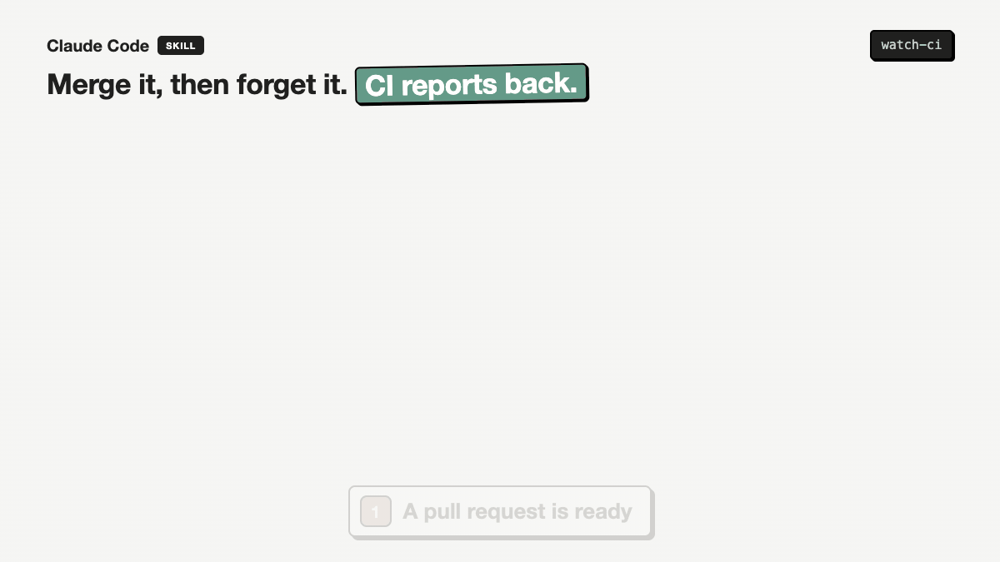

# watch-ci

Watches GitHub CI for a pull request, a merge or a commit until every check has truly finished,
then tells the session GREEN or RED by itself. Part of [claude-plugins](../../../../README.md).



I kept having to tell Claude "merged", then ask "what is the state?". Watching CI meant a polling
loop written on the spot, run in the foreground, cut off at 600 seconds, and checked only when I
asked. This skill runs one read only script as a background job instead. Claude Code tells the
session when a background job ends, so the result arrives without anyone asking.

## What it does

1. **Starts with the merge command.** When Claude hands you a merge command, it starts
   `watch.sh <PR> --merge` in the background in the same turn. The script waits for the merge,
   then watches the merge commit.
2. **Watches everything GitHub knows about the commit**, from three sources:
   - GitHub Actions workflow runs,
   - check runs from other CI apps (CircleCI, Buildkite, Codecov, a deploy app),
   - commit statuses (deploy previews and older integrations).
3. **Waits for late starters.** It needs two quiet polls in a row, because some workflows only
   start after another finishes (a smoke test after the deploy reports). A rerun keeps it open.
4. **Ignores noise.** Dependabot update jobs on the default branch are listed but never decide
   the verdict.
5. **Gives up honestly.** Nothing reported after 4 minutes means CI will never run, so it says
   `NO CI` instead of waiting forever.
6. **Explains a red.** It names the failing job and step, tells an infrastructure hiccup (only
   setup, install, download or cache steps failed) from a real failure, and prints the rerun
   command.

The last line is always `WATCH RESULT: GREEN | RED | NO CI | TIMEOUT | ERROR`. Exit code 0 is
green, 1 red, 2 anything else.

## Use

Say "watch the CI", "tell me when it finishes", or just merge a pull request with Claude. The
script can also run on its own:

| Command | Watches |
|---|---|
| `watch.sh` | The newest commit on the default branch |
| `watch.sh 42` | Pull request 42's latest commit |
| `watch.sh 42 --merge` | Waits for pull request 42 to merge, then the merge commit |
| `watch.sh my-branch` | The newest commit on that branch |
| `watch.sh 1a2b3c4` | That commit |

## Options

No config file. Everything is an option with a default.

| Option | What it is for | Default |
|---|---|---|
| `--repo owner/name` | The repository to watch | The repo of the current folder |
| `--gate-job NAME` | A job that only fails because another failed (a "gate" that sums up the others); skipped when explaining a failure. Repeatable | none |
| `--timeout MIN` | Give up watching CI after this long | 60 |
| `--merge-timeout MIN` | Give up waiting for the merge after this long | 240 |
| `--interval SEC` | Seconds between polls | 20 |

If your project's repo is not the folder Claude runs in, or it has a gate job, put a line in
that project's `CLAUDE.md`, for example: "watch-ci: use `--repo acme/shop --gate-job "ci gate"`".

## What it will never do

It only reads. It never merges, reruns, cancels or dispatches anything; those commands stay with
you. It never calls a red green, and never turns a timeout into "probably fine".

## Requirements

- [`gh`](https://cli.github.com) (GitHub CLI), signed in with read access to the repository
- Bash and `awk` (macOS and Linux have both)
- Only CI that reports to GitHub is seen. A CI server that never posts results back to the
  commit is invisible to it.

## Install

```
/plugin marketplace add mutlumehmet/claude-plugins
/plugin install dev-workflow@mehmetmutlu
```

## About

[](https://www.mehmetmutlu.dev)

Made by Mehmet Mutlu, part of [claude-plugins](../../../../README.md). More of his work at [mehmetmutlu.dev](https://www.mehmetmutlu.dev). If it saves you time, you can [sponsor me on GitHub](https://github.com/sponsors/mutlumehmet) or [buy me a coffee](https://buymeacoffee.com/mutlumehmet).
