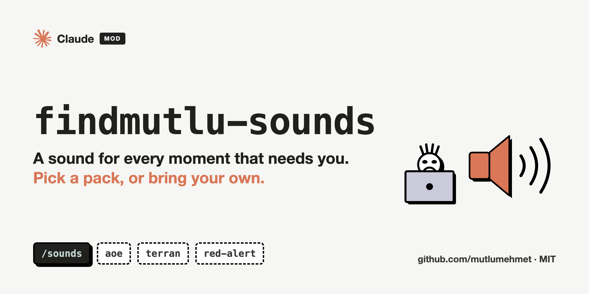
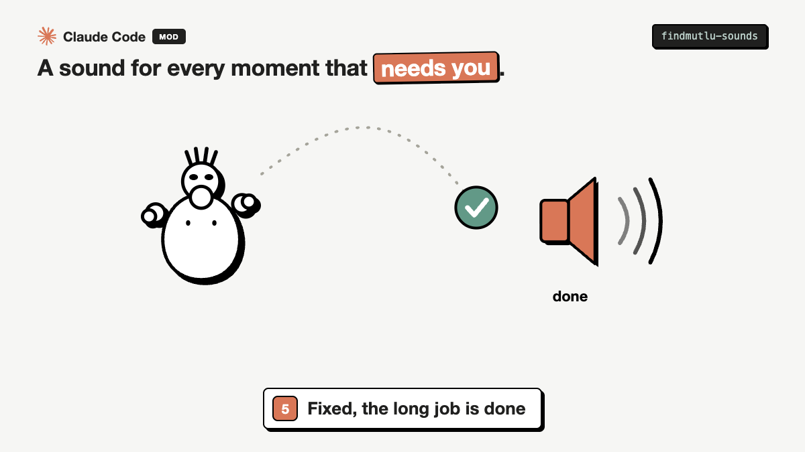
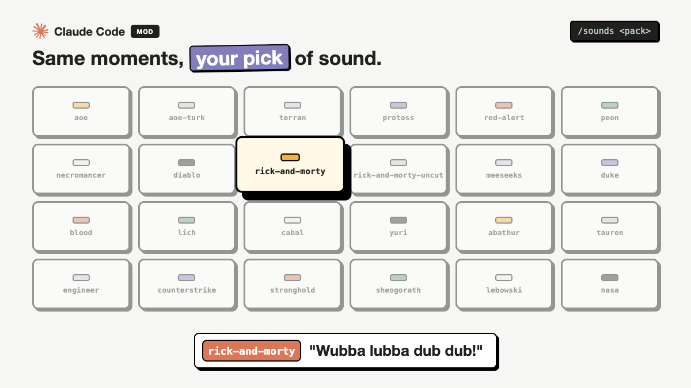

# findmutlu-sounds

[](../../docs/videos/findmutlu-sounds-how.mp4)

A Claude Code mod that plays a short sound at the moments that need you, and at no other time:
Claude asks for your OK, a long job finishes, a test fails, a push goes through. Pick a Terran
SCV, a Protoss zealot, an Age of Empires monk or Turkish villager, a Kirov airship, a Diablo II necromancer, Duke Nukem, Pickle Rick, Caleb from Blood, or the NASA
radio. Part of [claude-plugins](../../README.md).

## How it works

[](../../docs/videos/findmutlu-sounds-how.mp4)

**[Watch it with sound](../../docs/videos/findmutlu-sounds-how.mp4)** (30 seconds, the aoe pack).

| Moment | When |
|---|---|
| `ordered` | You send a prompt after 5 quiet minutes (an order given, back at work) |
| `needsYou` | Claude waits for you: a permission prompt, a question for you or a plan to approve |
| `longDone` | A turn that took 60 seconds or more is answered |
| `subagent` | A subagent finishes |
| `failed` | A test, build, lint or type check fails (a step such as `npm test`, `pytest`, `tsc` or `scripts/check-x.sh` exits with an error; text inside a heredoc never counts) |
| `pushed` | `git push` goes through |
| `compacted` | The conversation is compacted |

At most one sound every 2.5 seconds across all your terminals, so a handful of subagents finishing
together give one sound, not a choir. The same clip never plays twice in a row for a moment. A pack
may leave a moment silent.

## The packs

[](../../docs/videos/findmutlu-sounds-tour.mp4)

**[Hear the packs](../../docs/videos/findmutlu-sounds-tour.mp4)** (41 seconds).

| Pack | What it sounds like | Source |
|---|---|---|
| `aoe` (default) | "Wololo", the horn, the villager's "Yes", and the taunts: "Start the game already!", "What age are you in?", "You played two hours to die like this?" at a failed test, "Raiding party!" on a push | Age of Empires II, under Microsoft's [Game Content Usage Rules](https://www.xbox.com/en-US/developers/rules) |
| `aoe-turk` | The Turkish villager: "Emrin?" (your order?), "Tamam" (OK), "Hazir" (ready), "Saldir!" (attack!) on a push, the job names when a subagent returns | Age of Empires II, under Microsoft's [Game Content Usage Rules](https://www.xbox.com/en-US/developers/rules), via the [openpeon pack](https://openpeon.com/packs/aoe2-villager-turkish-male) by Yusuf Kinatas |
| `terran` | "SCV good to go, sir", "You want a piece of me, boy?", "Nuclear launch detected", "In the pipe, five by five" | StarCraft, Blizzard Entertainment |
| `protoss` | "En Taro Adun", "You must construct additional pylons", "My life for Aiur!", "Power overwhelming" | StarCraft, Blizzard Entertainment |
| `red-alert` | "Kirov reporting", "For mother Russia", "Your mind is clear", "Kaboom" | Command & Conquer: Red Alert 2, Electronic Arts |
| `peon` | "Work work", "Zug zug", "Something need doing?", "Me not that kind of orc" | Warcraft III: Reign of Chaos, Blizzard Entertainment |
| `necromancer` | "Raise skeleton" when a subagent returns, "Not enough mana", "I can't carry any more" at compaction | Diablo II: Lord of Destruction, Blizzard Entertainment |
| `diablo` | The level up chime, the quest done fanfare, gold dropping, a town portal opening, an item breaking | Diablo II: Lord of Destruction, Blizzard Entertainment |
| `rick-and-morty` | "Wubba lubba dub dub", "Show me what you got!", "I'm Pickle Rick!" on a push, the butter robot's "What is my purpose?" when a subagent returns, "Oh jeeze" at a failed test | Rick and Morty, Warner Bros. Discovery (Adult Swim), via the family-friendly [openpeon pack](https://openpeon.com/packs/rick-and-morty-clean) by Mr3zee |
| `rick-and-morty-uncut` | The swearing lines: "You son of a bitch, I'm in!", "Oh fuck me!", "Everybody fuck off!" on a push. Explicit language, never the default | Rick and Morty, Warner Bros. Discovery (Adult Swim), via the mature [openpeon pack](https://openpeon.com/packs/rick-and-morty) by Mr3zee |
| `meeseeks` | Mr. Meeseeks: "Can do!", "I'm Mr. Meeseeks, look at me!" when a subagent returns, "All done!", "I can't take it anymore!" at a failed test | Rick and Morty, Warner Bros. Discovery (Adult Swim), via the [openpeon pack](https://openpeon.com/packs/mrmeeseeks) by kasperhendriks |
| `duke` | "Come get some", "Hail to the king, baby", "Groovy", "Ooh, that's gotta hurt" | Duke Nukem 3D, Gearbox Software |
| `blood` | Caleb: "Let's go", "I won", "Boomstick", "Pathetic", the laugh | Blood (Monolith Productions, 1997) |
| `lich` | The Lich and Kel'Thuzad: "As the master commands", "Thy bidding, master?", "Kneel before my Frost Nova!" on a push, "The Scourge will consume all!" at compaction | Warcraft III, Blizzard Entertainment, via the [openpeon pack](https://openpeon.com/packs/wc3_lich) |
| `cabal` | CABAL, the Nod AI: "Establishing battlefield control", "Primary objective achieved", "Reinforcements have arrived" when a subagent returns, "Construct more power plants" at compaction | Command & Conquer: Tiberian Sun, Electronic Arts, via the [openpeon pack](https://openpeon.com/packs/tiberian-sun-cabal) |
| `yuri` | "Your thoughts are mine", "I foresaw this need", "Another pawn joins us" when a subagent returns, "I did not foresee this" at a failed test | Red Alert 2: Yuri's Revenge, Electronic Arts, via the [openpeon pack](https://openpeon.com/packs/ra2_yuri) |
| `abathur` | The Zerg evolution master, in his own long winded way: evolution done for a long job, a help call when Claude waits | StarCraft II, Blizzard Entertainment, via the [openpeon pack](https://openpeon.com/packs/sc2_abathur) |
| `tauren` | "Peace and patience, friend", "Fate smiles upon you", "For the Horde!" on a push, "My inventory is full" at compaction | World of Warcraft, Blizzard Entertainment, via the [openpeon pack](https://openpeon.com/packs/wow-tauren) |
| `engineer` | "Teleporter comin' right up", "Done and done", "You just ain't doin' it right" at a failed test, "Yeehaw!" on a push | Team Fortress 2, Valve, via the [openpeon pack](https://openpeon.com/packs/tf2_engineer) |
| `counterstrike` | The radio calls: "Roger that", "Need backup!", "Area clear!", "Enemy spotted!", "Lock and load!" on a push | Counter-Strike, Valve, via the [openpeon pack](https://openpeon.com/packs/counterstrike) |
| `stronghold` | The AI lords, a different one each time: Richard's "The lion roars", the Rat's "Plans worked perfectly", the Abbot's "My troops fail me", the Sheriff's "Not Father Christmas" | Stronghold Crusader, FireFly Studios, via the openpeon packs of the lords (for example [the Abbot](https://openpeon.com/packs/abbot)) |
| `sheogorath` | The Prince of Madness: "Good choice", "I've been waiting for you", "Cheese for everyone", "Boring, boring, boring" at a failed test | The Elder Scrolls IV: Oblivion, Bethesda (ZeniMax), via the [openpeon pack](https://openpeon.com/packs/sheogorath) |
| `lebowski` | The clean lines: "The Dude abides", "Phone's ringing, Dude", "That rug really tied the room together", "Over the line!", "Mark it zero!" | The Big Lebowski (1998), Universal Pictures, via the [openpeon pack](https://openpeon.com/packs/the-big-lebowski) |
| `nasa` | "The Eagle has landed", "And the liftoff!", "Okay Houston, we have had a problem here", a Quindar beep | NASA recordings on [Wikimedia Commons](https://commons.wikimedia.org), public domain |

Each pack's folder under [`sounds/`](sounds) has a `CREDITS.md` with the source of every clip and
who holds its rights. The game clips are the original files as shared on
[101soundboards](https://www.101soundboards.com) and in [openpeon](https://openpeon.com) packs,
unchanged except that WAV and Ogg originals are stored as M4A (smaller, and macOS `afplay` stops Ogg clips after about a second), and the short intro 101soundboards puts before some clips is cut where the site's own player skips it. They belong to their publishers:
this plugin is free fan use, not licensed, not endorsed by any of them, and never sold. If you
hold the rights to a pack and want it gone, open an issue and it goes.

## Use

| Command | Effect |
|---|---|
| `/sounds` | This terminal's pack, the default for new terminals, the settings and every pack |
| `/sounds <pack>` | Switch this terminal only |
| `/sounds default <pack>` | The pack every new terminal starts with |
| `/sounds test [pack]` | Play every sound of a pack once, whatever the settings |
| `/sounds off`, `/sounds on` | Mute, unmute |
| `/sounds away`, `/sounds always` | Play only while no terminal or editor is the front app, or always (the default). The prompt answer still plays in away mode: you are at the keyboard |
| `/sounds night off`, `/sounds night on` | Quiet hours from 23:00 to 07:00, on by default |

Install asks nothing. The first session shows one notice naming the pack and `/sounds`. Settings
are kept in the plugin's store, per Claude Code config directory.

## Your own packs

A folder under `~/.config/findmutlu-sounds/packs/<name>/` (lowercase letters, digits and dashes)
with your clips and a `pack.json` is a pack. It loads when a session starts and then works like
the others (`/sounds <name>`, `/sounds default <name>`):

```json
{
  "label": "My office",
  "ordered": ["yes-boss.m4a"],
  "needsYou": ["knock.wav"],
  "longDone": ["applause.mp3"],
  "subagent": [],
  "failed": ["sigh.wav"],
  "pushed": ["cheer.m4a"],
  "compacted": []
}
```

WAV, MP3, M4A and AIFF play. A built-in pack's name always means the built-in pack. Your clips
stay on your machine: nothing is uploaded.

To add a pack to this plugin for everyone: a folder under `sounds/` with the clips, a `pack.json`
like the one above and a `CREDITS.md` naming the source and rights holder of every clip, then `python3
scripts/packs.py`, which writes the table in `hooks/register.js` (CI checks it is up to date).

## What it reads and does

- **Reads**: when a turn starts and ends, Bash commands and whether they failed, permission
  notifications, questions and plans waiting for you, subagent and compaction events, and your
  packs folder at session start. In away mode, the name of the front app (`lsappinfo`, no
  permission needed).
- **Does**: plays a clip (`afplay` underneath), never waiting for it, so
  nothing slows down. Answers its own `/sounds` command and no other. Writes one file,
  `~/.config/findmutlu-sounds/last-played` (the time of the last sound), so your terminals take
  turns instead of talking over each other.
- **Hooks**: `tool.call` (Bash, AskUserQuestion, ExitPlanMode) plays a sound and passes the
  call on; it never changes or blocks a call. `prompt.submit`, `turn.complete` and the notification, subagent and compaction
  events pass through unchanged.
- **Privacy**: see [PRIVACY.md](../../PRIVACY.md).
- **Never**: sends anything anywhere (no network calls, no telemetry).

## Install

Needs Claude Code 2.1.287 or later (mods) on macOS. Tested on 2.1.294.

```
/plugin marketplace add mutlumehmet/claude-plugins
/plugin install findmutlu-sounds@mehmetmutlu
```

A mod runs inside Claude Code with your permissions. Read the code before you install any mod.

## Known gaps

- macOS only: Claude Code plays clips with `afplay`. On Linux and Windows the
  mod loads and stays silent.
- `failed` knows check steps by name (npm, pnpm, yarn, make, cargo or go with test, build, lint,
  typecheck or check; pytest, jest, vitest, tsc, playwright, eslint; scripts named check-, test-
  or lint-), so a failing script with another name stays silent.
- Your choice of pack for one terminal (`/sounds <pack>`) resets when the plugin reloads; the
  default does not.

## About

[](https://www.mehmetmutlu.dev)

Made by Mehmet Mutlu, part of [claude-plugins](../../README.md). More of his work at [mehmetmutlu.dev](https://www.mehmetmutlu.dev).

## License

Code: [MIT](../../LICENSE). Sounds: not covered by the MIT license. NASA clips are public domain; the game clips belong to their publishers, as each `sounds/<pack>/CREDITS.md` says.
