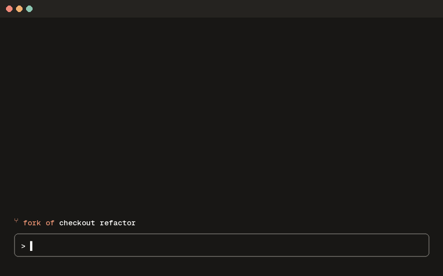
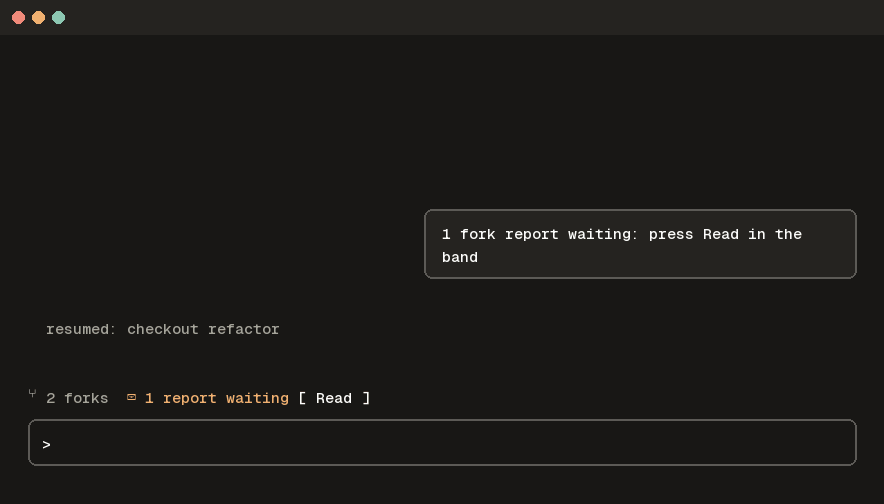
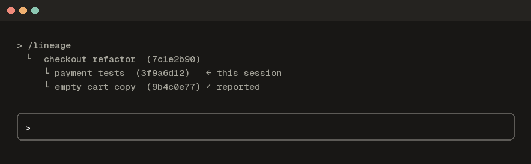

# fork-lineage

A Claude Code mod that remembers which session a fork came from, shows it above the prompt, and
carries a fork's report back to its parent when you say so. Part of
[claude-plugins](../../README.md) and of the Claude Code Toolkit.



## Why

You fork a session to try something on the side, rename it, rename the parent, and a day later
nobody remembers which came from which. The work done in the fork stays in the fork, unless you
copy it back by hand. fork-lineage keeps the link and makes the hand back one button.

## What it does

- **In a fork**: the band above the prompt says `⑂ fork of <parent title>`, with a
  `↑ report to parent` button while the fork has prompts of its own that were never reported.
  After a report it says `✓ reported`, and the button comes back when you do more work.
- **The report**: the button (or `/report-parent`) asks the fork's own model for a short report of
  what was decided, changed and left open in the fork. It shows the report and asks: **Send to
  parent**, **Not needed** or **Cancel**. Nothing is sent before you pick Send.
- **Parent running**: the report reaches it at once, as a message from the fork.
- **Parent closed**: the report waits. When you resume the parent, a blinking
  `📬 1 report waiting` and a **Read** button appear. Read shows the report and adds it to the
  conversation without running a turn. If you never press it, the report goes along with your next
  message instead, so it is never lost and never arrives twice.
- **In a parent**: the band says `⑂ N forks`.
- **`/lineage`**: the whole family tree with the current titles, your session marked.
- **At 80% and 90% context**, a fork that has not reported yet gets one reminder.





## How it works

Nothing about the link is stored when you fork. Every time, the mod works it out from Claude Code's
own transcripts, and reads each session's title at that moment, so renaming a parent or a fork never
breaks anything.

1. **Who is the parent.** A fork copies its parent's messages with the same message ids. Among the
   older sessions that hold the fork's first message, the parent is the one sharing the most
   message ids (then the longest shared start, then the oldest). If the transcript names its parent
   (`forkedFrom`), that wins. Checked against that field on 25 sessions with the field hidden: 25
   right.
2. **The report.** A tool-less call over the fork's own transcript, told first which side it is on
   (the copied history starts with the parent's conversation and name, which once made the model
   report as the parent).
3. **Delivery.** Live: addressed to the parent's session id. Closed: a small file in the parent's
   inbox, picked up by this mod when the parent comes back.

The files live in `~/.claude-forks/` (`CLAUDE_FORKS_DIR` overrides) and follow a small open contract,
[CONTRACT.md](CONTRACT.md), so another tool (a session dashboard, a launcher) can read and write the
same links and reports without depending on this mod. Writes are atomic, and an inbox entry is
claimed before it is delivered.

**Cleanup**, at most once a day: a fork's link and reports go once Claude Code has removed its
transcript (`cleanupPeriodDays`), and a delivered report 30 days after delivery. A report that was
never delivered is never deleted.

## What it reads and does

- **Reads**: Claude Code's transcripts under your config dir (`~/.claude/projects/`), read only, to
  find parents, forks, titles and prompt counts. Its own files under `~/.claude-forks/`.
- **Writes**: only under `~/.claude-forks/`: links, approved reports, inbox entries.
- **Does**: draws a line in the band, a toast, transcript lines, the approval question. On Send, one
  message to the parent session on this machine. On Read, the report as a user row in the parent's
  conversation.
- **Model calls**: one per report, through Claude Code itself (`$.model.fork`, the same model and
  account as the session), only when you press the button.
- **Hooks**: `prompt.submit` adds a waiting report to your next message (it never changes your
  text); `turn.complete` refreshes the band; `command.run` answers `/lineage` and `/report-parent`
  only.
- **Runs**: `python3` on its own `hooks/lineage.py`, which reads the transcripts (they can be larger
  than a mod may read directly) and does the atomic file writes.
- **Never**: sends a report without your Send, edits a transcript, or makes a network call of its
  own. Reports can hold conversation content; they stay on your machine.

## Install

Needs Claude Code 2.1.289 or later (mods) and `python3`.

```
/plugin marketplace add mutlumehmet/claude-plugins
/plugin install fork-lineage@mehmetmutlu
```

Or the whole Toolkit: `/plugin install toolkit@mehmetmutlu`.

A mod runs inside Claude Code with your permissions. Read the code before you install any mod.

## Known gaps

- A fork made from a session in another config dir (another account) is found only when the
  transcript names its parent.
- A parent session in a different permission mode may hold a live report for approval; the mod
  counts it as delivered once queued.
- The report shows as one transcript line per report line (a transcript line takes no line breaks).
- Nothing is drawn in the VS Code chat panel.

## About

[](https://www.mehmetmutlu.dev)

Made by Mehmet Mutlu, part of [claude-plugins](../../README.md). More of his work at [mehmetmutlu.dev](https://www.mehmetmutlu.dev).

## License

[MIT](../../LICENSE)
